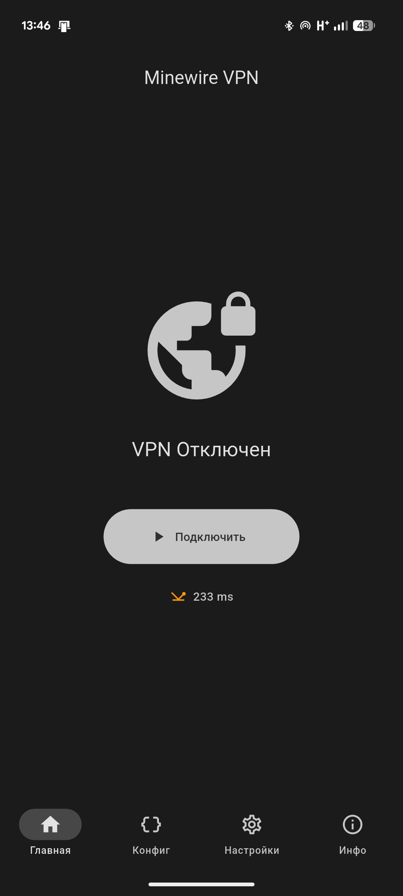
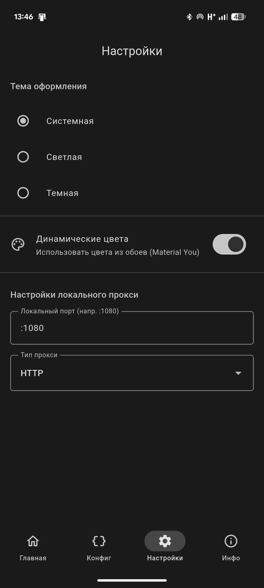

# Minewire VPN

Кроссплатформенный VPN-клиент, маскирующийся под Minecraft клиент для обхода ограничений и создания защищенных туннелей.

## Возможности

- 🔒 **Шифрование AES-GCM** - весь трафик шифруется и маскируется под пакеты Minecraft
- 🎮 **Полная маскировка** - неотличим от настоящего Minecraft клиента при DPI
- 🚀 **Мультиплексирование** - множественные соединения через один туннель (yamux)

## Скриншоты

<div align="center">



</div>

## Требования

### Для использования

- **Android**: Android 5.0 (API 21) или новее
- **Windows**: Windows 10/11

### Для сборки из исходников

- **Flutter SDK**: 3.5.0 или новее
- **Go**: 1.19 или новее
- **gomobile**: для сборки Android библиотеки
- **Android SDK**: для сборки Android приложения
- **Visual Studio Build Tools**: для сборки Windows приложения

## Установка

### Из готовых релизов

Скачайте последнюю версию из раздела [Releases](https://github.com/dmitrymodder/minewire-app/releases):

- **Android**: `minewire-app-arm64-v8a-release.apk` (для большинства современных устройств)
- **Windows**: `minewire-windows.zip` (распакуйте и запустите `minewire_app.exe`)

### Сборка из исходников

#### Подготовка

1. **Установите Flutter**:
   ```bash
   # Следуйте инструкциям на https://flutter.dev/docs/get-started/install
   flutter doctor
   ```

2. **Установите Go**:
   ```bash
   # Скачайте с https://golang.org/dl/
   go version  # Проверка установки
   ```

3. **Установите gomobile** (для Android):
   ```bash
   go install golang.org/x/mobile/cmd/gomobile@latest
   gomobile init
   ```

#### Сборка для Android

```bash
# 1. Клонируйте репозиторий
git clone https://github.com/dmitrymodder/minewire-app.git
cd minewire-app

# 2. Соберите Go библиотеку
cd go
gomobile bind -target=android -o ../android/app/libs/minewire.aar -androidapi 21 -javapkg=com.uberwelt.libminewire .
cd ..

# 3. Установите зависимости Flutter
flutter pub get

# 4. Соберите APK
flutter build apk --release --split-per-abi

# Готовые APK будут в build/app/outputs/flutter-apk/
# - app-armeabi-v7a-release.apk (для старых устройств)
# - app-arm64-v8a-release.apk (для современных устройств, рекомендуется)
# - app-x86_64-release.apk (для эмуляторов)
```

#### Сборка для Windows

```bash
# 1. Клонируйте репозиторий (если еще не сделали)
git clone https://github.com/dmitrymodder/minewire-app.git
cd minewire-app

# 2. Установите зависимости Flutter
flutter pub get

# 3. Соберите Windows приложение
flutter build windows

# Готовое приложение будет в build/windows/x64/runner/Release/
```

## Использование

### Первый запуск

1. **Запустите приложение**
2. **Перейдите в раздел "Конфиг"**
3. **Создайте новый профиль**:
   - Введите адрес сервера (например: `server.example.com:25565`)
   - Введите пароль (получите у администратора сервера)
   - Дайте профилю понятное имя

4. **Выберите созданный профиль** (нажмите на него)
5. **Вернитесь на главный экран** и нажмите "Подключить"

### Импорт конфигурации по ссылке

Если у вас есть ссылка формата `mw://password@server:port#ProfileName`, вы можете:

1. Открыть ссылку на устройстве (она автоматически откроется в приложении)
2. Или вставить ее в поле импорта в разделе "Конфиг"

### Настройки

В разделе "Настройки" вы можете:

- **Изменить тип прокси**: SOCKS5 (по умолчанию) или HTTP
- **Изменить локальный порт**: по умолчанию `:1080`
- **Настроить тему**: светлая, темная или системная
- **Включить/отключить динамические цвета** (только Android 12+)

### Использование VPN (Android)

При подключении на Android автоматически создается VPN соединение:

- Весь трафик устройства идет через туннель
- В панели уведомлений отображается статус VPN
- Для остановки нажмите "Отключить" в приложении

### Использование прокси (Windows)

На Windows приложение создает локальный SOCKS5/HTTP прокси:

1. После подключения прокси доступен на `127.0.0.1:1080`
2. Настройте браузер или приложения на использование этого прокси
3. Или используйте системные настройки прокси Windows

## Настройка браузера (Windows)

### Firefox

1. Настройки → Основные → Параметры сети → Настроить
2. Выберите "Ручная настройка прокси"
3. SOCKS Host: `127.0.0.1`, Port: `1080`
4. Выберите "SOCKS v5"
5. Включите "Использовать прокси DNS при использовании SOCKS v5"

### Chrome/Edge

1. Настройки → Система → Открыть настройки прокси-сервера компьютера
2. Или используйте расширение типа SwitchyOmega

## Архитектура

### Компоненты

- **Flutter UI** (`lib/`) - кроссплатформенный интерфейс на Dart
- **Go Core** (`go/`) - ядро VPN/прокси на Go, компилируется в:
  - Android: AAR библиотека через gomobile
  - Windows: используется напрямую через FFI
- **Platform Channels** - связь между Dart и Go кодом

### Как это работает

1. **Маскировка**: Клиент подключается к серверу как Minecraft клиент
2. **Аутентификация**: Генерирует имя пользователя из хеша пароля
3. **Туннелирование**: Устанавливает зашифрованный yamux туннель
4. **Шифрование**: Весь трафик шифруется AES-GCM и маскируется под пакеты чанков Minecraft
5. **Проксирование**: 
   - Android: tun2socks перехватывает весь трафик и отправляет через туннель
   - Windows: локальный SOCKS5/HTTP прокси перенаправляет трафик

## Устранение неполадок

### Android

**Приложение не подключается**:
- Проверьте адрес сервера и пароль
- Убедитесь, что сервер доступен (проверьте пинг)
- Проверьте разрешения приложения

**VPN не работает**:
- Перезапустите приложение
- Проверьте, нет ли других VPN приложений
- Убедитесь, что разрешение VPN предоставлено

### Windows

**Приложение не запускается**:
- Установите Visual C++ Redistributable
- Запустите от имени администратора (если требуется)

**Прокси не работает**:
- Проверьте, что приложение подключено
- Убедитесь, что порт 1080 не занят другим приложением
- Проверьте настройки файрвола

**Иконка не отображается в трее**:
- Убедитесь, что файл `app_icon.ico` находится в `data/flutter_assets/assets/`

### Общие проблемы

**Медленное соединение**:
- Проверьте пинг до сервера
- Попробуйте другой сервер ближе к вам
- Проверьте скорость интернета

**Частые разрывы соединения**:
- Проверьте стабильность интернет-соединения
- Увеличьте таймауты в настройках сервера

## Разработка

### Структура проекта

```
minewire_app/
├── android/          # Android специфичный код
├── windows/          # Windows специфичный код
├── lib/              # Flutter/Dart код
│   ├── main.dart           # Точка входа
│   ├── config_page.dart    # Управление профилями
│   ├── settings_page.dart  # Настройки
│   ├── about_page.dart     # О приложении
│   ├── models/             # Модели данных
│   └── services/           # Сервисы (platform channels)
├── go/               # Go библиотека (Android)
│   ├── minewire.go   # Основная логика
│   ├── tunnel.go     # Туннель к серверу
│   ├── protocol.go   # Minecraft протокол
│   └── proxy.go      # SOCKS5/HTTP прокси
├── go-windows/       # Go библиотека (Windows)
└── assets/           # Ресурсы (иконки, изображения)
```

### Запуск в режиме разработки

```bash
# Android (эмулятор или устройство)
flutter run

# Windows
flutter run -d windows
```

### Отладка Go кода

```bash
# Тестирование Go библиотеки
cd go
go test ./...

# Сборка для проверки
go build .
```

## Лицензия

MIT

## Связанные проекты

- [minewire-server](https://github.com/dmitrymodder/minewire) - серверная часть Minewire
